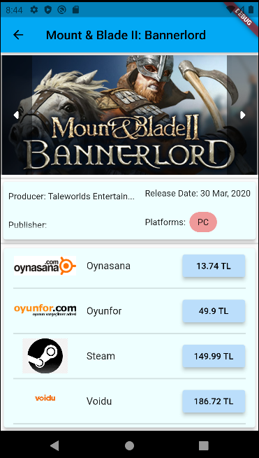

# Game Price Tracker App

I designed this app towards comparing game prices in different websites and sellers to provide cheapest possible price.

Main functionality is an infinite scroller where each game is listed with the cheapest top 4 prices found. Prices are fetched through web scrapping via Flutter/HTTP-HTML package. Upon that each price click sends user to the corresponding web store with url_launcher package. You can see screenshots from the working app below.

All the information in the app are fetched through several websites. Rather using APIs, it was more convinient and mostly the only way for many of them. Platforms are showed as a material Chip. And Image part is an actual gallery with several pictures fethed on fly.

